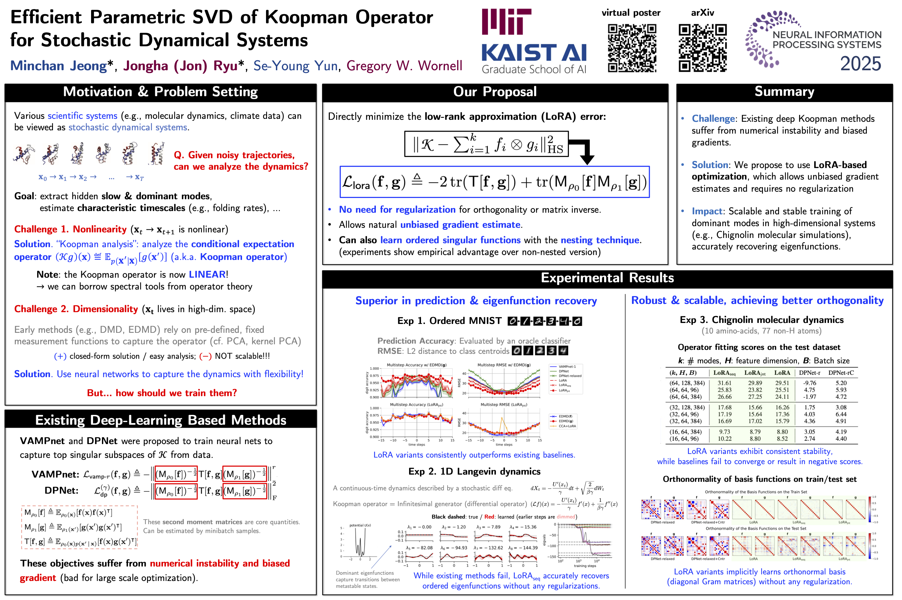

# NeuralKoopmanSVD

[](https://neurips.cc/)
[](https://arxiv.org/abs/2507.07222)
[](https://opensource.org/licenses/MIT)

 **Official PyTorch Implementation** for the paper:

> **Efficient Parametric SVD of Koopman Operator for Stochastic Dynamical Systems**\
> Minchan Jeong*, J. Jon Ryu*, Se-Young Yun, Gregory W. Wornell\
> *NeurIPS 2025*

<p align="center">
  
  <br>
  <em>Project Overview</em>
</p>

---

## Summary

*   **Challenge:** Existing deep learning methods for Koopman Operator approximation (e.g., VAMPnet, DPNet) often rely on numerical linear algebra operations (SVD, matrix inversions) during training. This leads to numerical instability and biased gradient estimates.
*   **Solution:** We propose **Efficient Parametric SVD** with Low-Rank Approximation (LoRA). By formulating the objective as a stable polynomial optimization problem, we enable **unbiased gradient estimation** and efficient mini-batch training.
*   **Impact:** Our method achieves scalable and stable training for high-dimensional systems (e.g., Chignolin protein folding), robustly recovering physical timescales and eigenfunctions where previous baselines diverge.
---

## Installation

This codebase supports **Python 3.11+** and **PyTorch**.

```bash
# 1. Clone the repository
git clone https://github.com/MinchanJeong/NeuralKoopmanSVD.git
cd NeuralKoopmanSVD

# 2. Install dependencies
# This automatically handles torch, lightning, and schnetpack
python -m pip install -e .
```

---

## Repository Structure

This repository is organized to separate the core library from experiment configurations, ensuring scalability and reproducibility.

```text
.
├── koopmansvd/              # Core Library
│   ├── models/              # PyTorch Lightning Modules & Losses (NestedLoRA, VAMPnet, DPNet, etc.)
│   ├── data/                # Scalable DataLoaders (Context, Molecular, IO)
│   ├── systems/             # Synthetic Datasets / Solvers (Logistic Map)
│   └── utils.py             # Distributed utilities
│
├── experiments/             # Reproduction Recipes
│   ├── configs/             # Hyperparameters via ml_collections
│   ├── pipelines/           # Data preprocessing & Analysis logic
│   ├── run_preprocessing.py # Data preparation entry point
│   ├── train.py             # Main training entry point
│   ├── run_post_inference.py # (Optional) Re-compute operator stats from checkpoint
│   └── run_analysis.py      # Post-training evaluation & plotting
│
└── scripts/                 # Bash scripts for benchmarks (DDP compatible)
```

---

## Pipeline Overview

You can also run individual steps manually for advanced control.

| Component | Script | Description |
| :--- | :--- | :--- |
| **Preprocessing** | `experiments/run_preprocessing.py` | Generates or downloads raw data and converts it into efficient formats for training. |
| **Training** | `experiments/train.py` | Trains the model and saves the trained Koopman operator statistics (`results.npz`). |
| **Re-evaluation** | `experiments/run_post_inference.py` | **(Optional)** Reloads a saved checkpoint to regenerate `results.npz`. Useful for re-calculating stats without re-training. |
| **Analysis** | `experiments/run_analysis.py` | Loads the model and `results.npz` to compute VAMP scores, eigenvalues, and generate plots. |

---

## Quick Start

### 1. Setup Environment
Create a `.env` file to configure your data paths (optional but recommended):

```bash
cp .env.example .env
# Edit .env to set DATA_DIR (default ./data) and RESULT_DIR
```

### 2. Run Benchmarks

We support **Ordered MNIST**, **Chignolin Molecular Dynamics**, and **Synthetic Stochastic Systems** (Logistic Map).\
**NOTE: See [`experiments/README.md`](experiments/README.md) for detailed dataset preparation and reproduction instructions.**


**Synthetic & MNIST (Auto-generated/downloaded)**
```bash
# Ordered MNIST
./scripts/run_orderedmnist.sh

# Noisy Logistic Map (1D Discrete)
./scripts/run_logistic.sh
```

**Molecular Dynamics**
```bash
# Chignolin Protein Folding (Requires dataset preparation)
# See experiments/README.md for download instructions
./scripts/run_chignolin.sh
```

**Debug Mode:**
Append `debug` to any script to run a quick 1-epoch test.
```bash
./scripts/run_orderedmnist.sh debug
```


### 3. Distributed Training (Multi-GPU)

This repository is built on **PyTorch Lightning**, supporting Distributed Data Parallel (DDP).

**Recommended: Using Scripts (Auto-Detection)**
Our scripts (`scripts/run_*.sh`) automatically detect the number of GPUs based on `CUDA_VISIBLE_DEVICES`. You don't need to manually set the device count.

```bash
# Example: Run on 4 GPUs (IDs: 0, 1, 2, 3)
# The script automatically sets --config.trainer.devices=4
CUDA_VISIBLE_DEVICES=0,1,2,3 ./scripts/run_chignolin.sh

# Example: Run on specific 2 GPUs
CUDA_VISIBLE_DEVICES=0,1 ./scripts/run_chignolin.sh
```

**Manual Execution**:
If you run `train.py` directly, you must explicitly specify the device count.

```bash
# Example: Manually running on 4 GPUs
CUDA_VISIBLE_DEVICES=0,1,2,3 python experiments/train.py \
    --config=experiments/configs/chignolin_schnet.py \
    --config.trainer.accelerator="gpu" \
    --config.trainer.devices=4 \
    --config.trainer.strategy="ddp"
```

### 4. Advanced Configuration

This project uses `ml_collections` for configuration management. You can override any parameter from the command line without modifying the config files.

**Example: Changing Learning Rate and Batch Size**
```bash
python experiments/train.py \
    --config=experiments/configs/mnist_cnn.py \
    --config.optimization.lr=0.0005 \
    --config.data.global_batch_size=512
```

**Example: Resuming and Extending Training**
To continue a previous run (e.g., from 50 to 200 epochs), use the helper script:
```bash
# Syntax: <Config> <Previous_Run_Dir> <New_Epochs>
./scripts/run_continue_training.sh \
    experiments/configs/chignolin_schnet.py \
    results/KoopmanSVD/chignolin_run_2025... \
    200
```

### 5. Experiment Outputs

After running a training script, results are saved in the `results/` directory with the following structure:

```text
results/
└── ProjectName/
    └── RunID_Timestamp/
        ├── checkpoints/      # Model weights (.ckpt) (Best & Last)
        ├── logs/             # Training metrics logs (CSV/WandB metadata)
        ├── analysis_results/ # Plots and metric JSONs generated by run_analysis.py
        ├── config.yaml       # Full hyperparameter snapshot for reproducibility
        ├── train_log.txt     # Console output log
        └── results.npz       # Learned operators, eigenvalues, and eigenfunctions
```

---

## Development & Testing

We provide a comprehensive test suite to ensure numerical stability and code integrity.

### Running Tests
Y
ou can run unit tests for individual components or the full integration suite using the provided script.

```bash
# Option 1: Run all unit tests via pytest
pytest tests/

# Option 2: Run full integration suite (Dry-run benchmarks)
# This checks the end-to-end pipeline for Logistic and MNIST.
./scripts/run_tests.sh
```
---

## Why NeuralKoopmanSVD?

Existing libraries like `kooplearn` provide excellent tools for kernel-based methods and general operator learning with a Scikit-learn compatible interface. **NeuralKoopmanSVD** is designed specifically for **Deep Learning researchers** who require end-to-end differentiable pipelines and GPU acceleration.

| Feature | `kooplearn` | **NeuralKoopmanSVD** (Ours) |
| :--- | :--- | :--- |
| **Design Philosophy** | Scikit-learn Style (General Purpose) | **PyTorch Lightning, DDP**|
| **Optimization** | Direct Linear Solvers / Kernel Methods | **Stochastic Gradient Descent**  |
| **Data Loading** | In-memory Arrays (`numpy`/`torch`) | **Streaming DataLoaders** (Custom Datasets) |
| **Key Benchmarks** | Tabular, Simple ODEs, Fluid Flow, Ala2 | **Molecular Dynamics (SchNet)**, Climate (TBA) |

**Use this repo if you need:**
*   **Deep Neural Encoders:** Seamless integration of GNNs (e.g., SchNet) or CNNs as lifting functions.
*   **Gradient-Based Learning:** Training with stochastic optimization (SGD/Adam) rather than closed-form linear algebra solutions.
*   **Large-Scale Data:** Built-in support for memory-mapped files and lazy-loading to handle datasets larger than RAM (e.g., ERA5, massive MD trajectories).
*   **Reproducible Pipelines:** Managing complex experiments via configuration files and automated preprocessing/analysis scripts.

---

## Method Overview

We employ the **Nested LoRA Objective** (Eq. 4 & 5 in the paper) which simultaneously learns the top-$k$ singular functions ordered by their importance.

```python
# koopmansvd/models/losses.py
from koopmansvd.models.losses import NestedLoRALoss

# Standard LoRA Objective: -2 Tr(T) + Tr(M_f M_g)
loss_discrete = NestedLoRALoss(n_modes=16, nesting='jnt')
```

This avoids the need for `torch.linalg.eigh` or `torch.linalg.inv` during the forward pass, ensuring stability even when batch sizes are small or eigenvalues decay rapidly.

---

## Citation

If you find this work useful, please cite our paper:

```bibtex
@inproceedings{jeong2025efficient,
title={Efficient Parametric {SVD} of Koopman Operator for Stochastic Dynamical Systems},
author={Minchan Jeong and Jongha Jon Ryu and Se-Young Yun and Gregory W. Wornell},
booktitle={The Thirty-ninth Annual Conference on Neural Information Processing Systems},
year={2025},
url={https://openreview.net/forum?id=kL2pnzClyD}
}
```

This work builds upon the theoretical framework of Neural SVD. Please also consider citing:

```bibtex
@inproceedings{ryu2024nestedlora,
title={Operator {SVD} with Neural Networks via Nested Low-Rank Approximation},
author={Ryu, Jongha Jon and Xu, Xiangxiang and Erol, Hasan Sabri Melihcan and Bu, Yuheng and Zheng, Lizhong and Wornell, Gregory W.},
booktitle={Proceedings of the 41st International Conference on Machine Learning},
year={2024},
url={https://proceedings.mlr.press/v235/ryu24b.html},
}

```

Our code repository is heavily inspired by and partially based on the `kooplearn` library:
```bibtex
@misc{turri2025kooplearnscikitlearncompatiblelibrary,
title={kooplearn: A Scikit-Learn Compatible Library of Algorithms for Evolution Operator Learning},
author={Giacomo Turri and Grégoire Pacreau and Giacomo Meanti and Timothée Devergne and Daniel Ordonez and Erfan Mirzaei and Bruno Belucci and Karim Lounici and Vladimir Kostic and Massimiliano Pontil and Pietro Novelli},
year={2025},
eprint={2512.21409},
archivePrefix={arXiv},
primaryClass={cs.LG},
url={https://arxiv.org/abs/2512.21409},
}
```

## TODO List
- [x] Implement `resume_from_checkpoint` logic for long-running experiments (ERA5).
- [ ] Support ERA5 dataset for global weather/climate applications.
- [ ] Support D. E. Shaw Research (DESRES) protein folding datasets.

## License

MIT License. See [LICENSE](LICENSE) for details.\
Copyright (c) 2025 Minchan Jeong, J. Jon Ryu, Se-Young Yun, Gregory W. Wornell.
